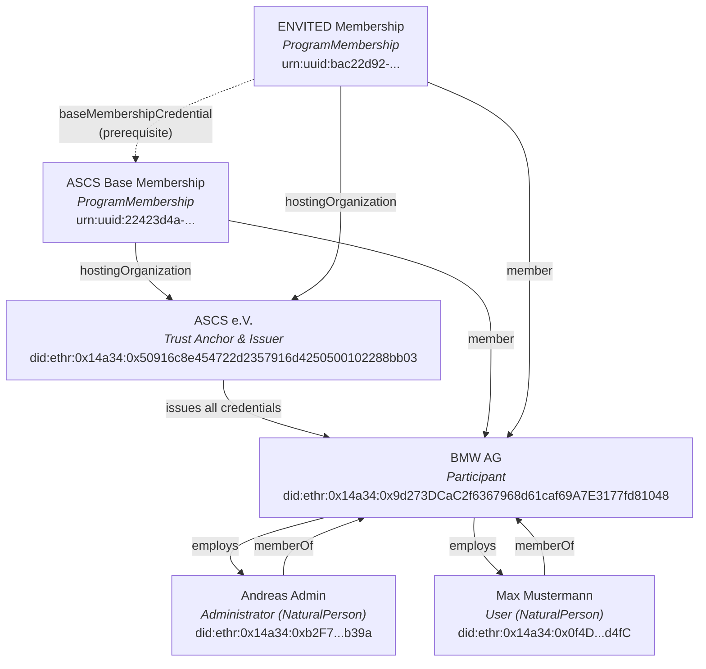
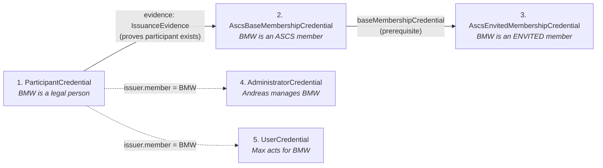
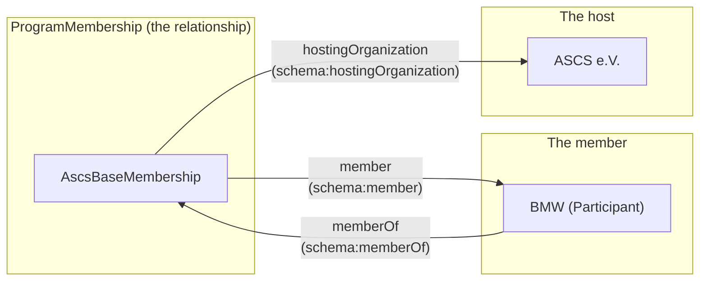

# SimpulseID Credential Relationships

This document explains how the five SimpulseID credential types relate to each other,
the entities they describe, and the semantic meaning of `member` vs `memberOf`.

## Entity Graph

The ENVITED ecosystem has four kinds of entities and five credential types that
bind them together:

## Credential Types and What They Prove

| # | Credential | Subject | Proves |
|---|-----------|---------|--------|
| 1 | `ParticipantCredential` | BMW (Participant) | BMW is a verified legal person in the ecosystem |
| 2 | `AscsBaseMembershipCredential` | a ProgramMembership | BMW holds ASCS e.V. base membership |
| 3 | `AscsEnvitedMembershipCredential` | a ProgramMembership | BMW holds ENVITED research cluster membership |
| 4 | `AdministratorCredential` | Andreas (Administrator) | Andreas is an authorized admin for BMW |
| 5 | `UserCredential` | Max (User) | Max is an authorized user under BMW |

## Issuance Flow and Prerequisites

Credentials are issued in a specific order. Some require prior credentials as evidence:

**Step by step (using BMW as the example):**

1. **ParticipantCredential** -- ASCS verifies BMW's legal identity (registration number,
   address, etc.) and issues a credential. The `credentialSubject` contains a nested
   `legalPerson` object typed `gx:LegalPerson` with Gaia-X compliant data.

2. **AscsBaseMembershipCredential** -- ASCS issues a base membership. The credential
   carries `evidence` containing the ParticipantCredential (proving BMW exists).
   The `credentialSubject` is a ProgramMembership with `member: BMW`.

3. **AscsEnvitedMembershipCredential** -- ASCS issues an ENVITED membership.
   The `baseMembershipCredential` field references the base membership (step 2)
   as a prerequisite. Without base ASCS membership, ENVITED membership cannot be issued.

4. **AdministratorCredential** -- ASCS issues credentials for BMW's admin (Andreas).
   The `issuer.member` field identifies BMW as the organization.

5. **UserCredential** -- BMW itself (acting as issuer) issues credentials to its users.
   The `issuer.member` still points to BMW (self-referential: BMW issues for its own users).

## `member` vs `memberOf` -- When to Use Which

These are two sides of the same relationship. The key is **which entity is the subject**:

### `member` (schema:member)

Used **on the membership object**, pointing **to the member**.

> "This membership **has** this member."

Appears in:
- **Membership credentialSubject** -- `"member": "did:ethr:0x14a34:0x9d27...1048"` identifies
  who holds the membership.
- **Issuer object** -- `"member": "did:ethr:0x14a34:0x9d27...1048"` identifies which
  participant this credential is issued for (SimpulseID convention using schema:member).

### `memberOf` (schema:memberOf)

Used **on the person/organization**, pointing **to what they belong to**.

> "This person **belongs to** this organization."

Appears in:
- **Administrator credentialSubject** -- `"memberOf": ["did:ethr:0x14a34:0x9d27...1048"]`
  means "Andreas belongs to BMW".
- **User credentialSubject** -- `"memberOf": ["did:ethr:0x14a34:0x9d27...1048"]`
  means "Max belongs to BMW".

### Why membership subjects have their own URN-UUIDs

A ProgramMembership is a **relationship object**, not a first-class entity with its own
DID. Each membership gets a unique `urn:uuid:` identifier that is distinct from both
the participant's DID and the credential envelope's `id`.

This avoids graph merge conflicts: if two membership credentials used the participant's
DID as `credentialSubject.id`, loading them into one RDF graph would merge all properties
onto a single node -- producing nonsensical data (BMW would have two `programName`
values, two contradictory types, etc.).

Similarly, evidence VC snippets (inline references to prior credentials) omit
`credentialSubject` to prevent merging with the full credential's subject when both
are in the same graph.

## Credential Subject Identity Summary

| Credential | credentialSubject.id | Why |
|-----------|---------------------|-----|
| ParticipantCredential | BMW's DID | The subject IS BMW |
| AdministratorCredential | Andreas's DID | The subject IS Andreas |
| UserCredential | Max's DID | The subject IS Max |
| AscsBaseMembershipCredential | own urn:uuid | The subject is a membership relationship, not an entity |
| AscsEnvitedMembershipCredential | own urn:uuid | The subject is a membership relationship, not an entity |
