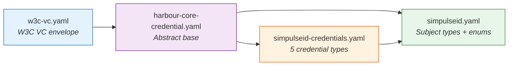
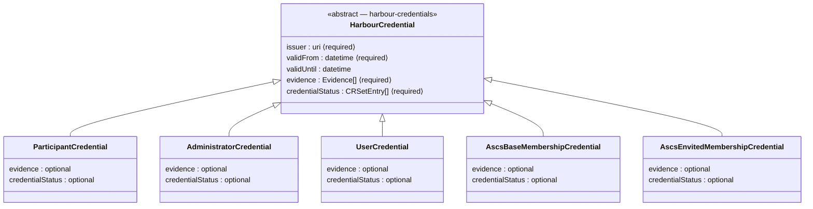
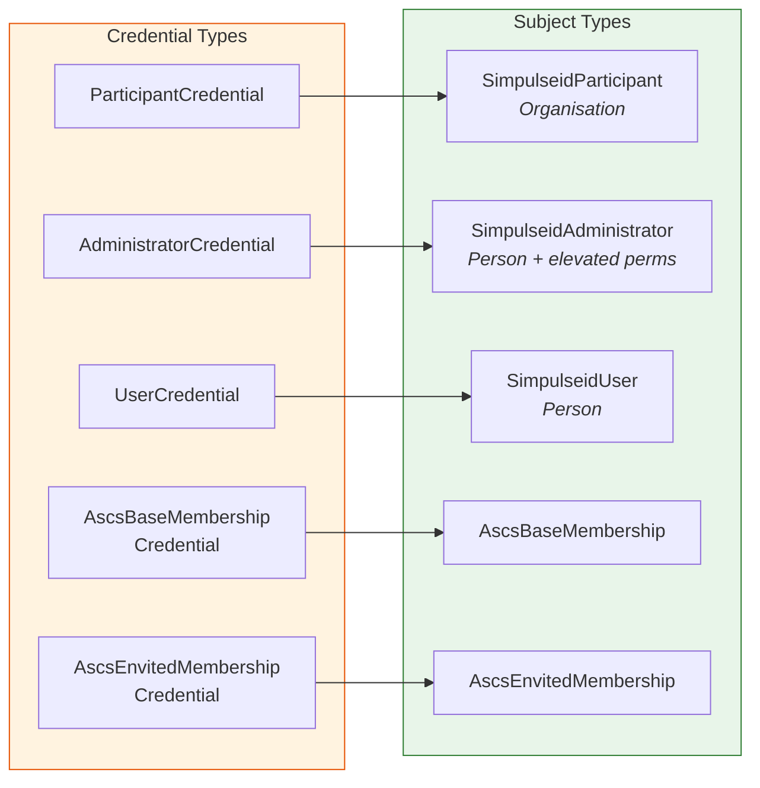
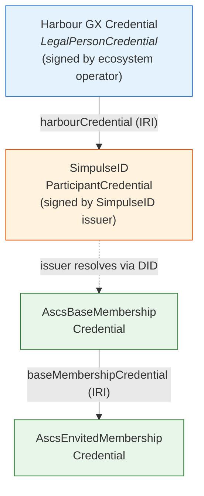

# Credential Data Model

This page documents how SimpulseID credential types extend the
[Harbour Credentials](https://ascs-ev.github.io/harbour-credentials/schema/credential-model/)
base model. For the base class hierarchy and Gaia-X composition pattern,
see the harbour-credentials documentation.

## Schema File Structure

```text
linkml/
├── importmap.json                # Maps import paths to submodule schemas
├── simpulseid.yaml               # Subject types, enums, business slots
└── simpulseid-credentials.yaml   # 5 credential types (is_a: HarbourCredential)
```

## Import Chain



Import paths in `importmap.json` resolve `./harbour` to the
`harbour-core-credential.yaml` file inside `submodules/harbour-credentials/`.

---

## Credential Type Hierarchy

All five SimpulseID credential types inherit from `HarbourCredential`
(defined in harbour-credentials). They override `evidence` and
`credentialStatus` to be **optional**, since not all issuance flows
require them immediately.



### Constraint Overrides (slot_usage)

| Field | Harbour Base | SimpulseID Override |
|-------|-------------|---------------------|
| `issuer` | required | *(inherited)* |
| `validFrom` | required | *(inherited)* |
| `evidence` | **required** | **optional** |
| `credentialStatus` | **required** (CRSetEntry) | **optional** |

---

## Credential ↔ Subject Type Mapping

Each credential type attests to a specific subject type. Subject types
are standalone classes (not inherited from `HarbourCredential`) that
define the `credentialSubject` claim structure:



### Subject Type Details

#### Organisation Subjects

| Field | Participant | Required |
|-------|------------|----------|
| `harbourCredential` | IRI to Harbour GX credential | **yes** |
| `legalForm` | `SimpulseIdLegalForm` enum | no |
| `duns` | DUNS number | no |
| `email` | Contact email | no |
| `url` | Website | no |
| `termsAndConditions` | T&C docs with integrity hash | no |
| `participant` | Nested Gaia-X compliance data | no |
| `name` | Organisation name | no |

#### Person Subjects

| Field | Administrator | User |
|-------|--------------|------|
| `harbourCredential` | **required** | **required** |
| `givenName` | **required** | optional |
| `familyName` | **required** | optional |
| `email` | **required** | optional |
| `memberOf` | optional | optional |
| `participant` | optional | optional |

#### Membership Subjects

| Field | Base Membership | ENVITED Membership |
|-------|----------------|-------------------|
| `member` | **required** (DID) | **required** (DID) |
| `programName` | optional | optional |
| `hostingOrganization` | optional | optional |
| `memberSince` | optional | optional |
| `baseMembershipCredential` | — | **required** (IRI) |

---

## Trust Chain

Credentials reference each other via IRI links to establish a chain
of trust from the ecosystem root to individual memberships:



The `harbourCredential` field in each subject type is an IRI reference
(not an embedded credential), keeping payload sizes small and enabling
independent verification of each layer.

---

## Legal Form Enum

The `SimpulseIdLegalForm` enum covers organisation types across
jurisdictions:

| Region | Values |
|--------|--------|
| **US** | `LLC`, `Corporation`, `LimitedPartnership`, `NonprofitCorporation` |
| **DE** | `GmbH`, `AG`, `Einzelunternehmen`, `GbR`, `OHG`, `KG`, `UG` |
| **UK** | `SoleTrader`, `Partnership`, `LimitedCompany`, `LLP`, `CIC`, `CIO`, `CooperativeSociety`, `BenCom`, `Trust`, `UnincorporatedAssociation` |
| **Fallback** | `other` |
